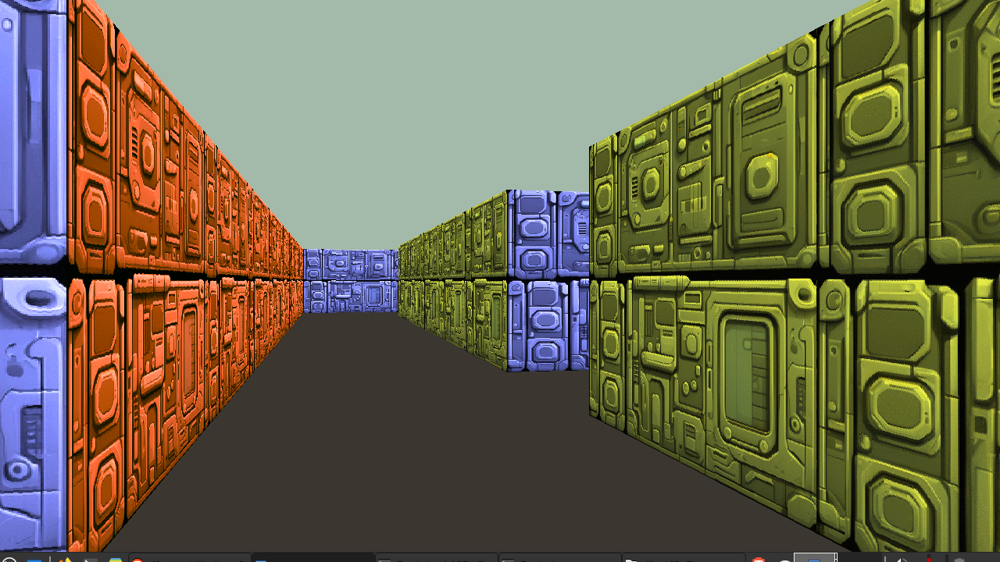

### cub3D
A 3D graphics engine built from scratch in C using raycasting.

**Requirements:**
- [minilibx-linux](https://github.com/42paris/minilibx-linux) – Required graphics library for this project.

