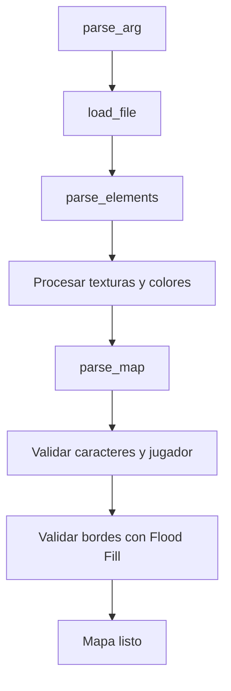

# Cub3D

## Introducción

Cub3D es la evolución de nuestro `so_long`, y utilizaremos estas mismas funciones:

- Relleno de mapas.
- Gestión de pulsaciones de teclas.
- Renderización de imágenes en pantalla.

## Entendiendo el Ray Casting

El **ray casting** es la base de Cub3D, permitiendo crear entornos 3D mediante técnicas 2D. Simula la proyección de rayos desde la perspectiva del jugador para generar profundidad y perspectiva.

### Conceptos clave:

1. **Proyección de rayos**: Transforma rayos en paredes visibles.
2. **Texturizado**: Aplica detalles a las superficies mediante matemáticas avanzadas.

---

## Detalles de Implementación

Además del ray casting, se requieren:

- Gestión de _buffers_ de imagen.
- Coloreado de texturas.

---

## Configuración del Entorno

**Herramientas necesarias**:

- Biblioteca **MinilibX** para renderizado gráfico.

**Recomendación**:  
Usa [42-CLI](https://github.com/herbievine/42-cli) para simplificar la instalación de MLX (compatible con macOS y Linux).

---

[](https://www.youtube.com/embed/g8p7nAbDz6Y?si=ttGoTxEICdLUaAMg&clip=Ugkx4WrcXp1Yttv_awOz4RlETRzVlO3ukYuw&clipt=ELa3ARjOrAI)

## Las Matemáticas del Ray Casting

### Paso 1: Dirección del Rayo


Esto implica determinar el ángulo del rayo con respecto a la vista del jugador y convertirlo en un vector unitario.
(Calculo el vector unitario del rayo basado en la posición y orientación del jugador)

```c
int x = 0;
while (x < WIN_WIDTH) {
    double camera_x = 2 * x / (double)WIN_WIDTH - 1;
    double ray_dir_x = dir_x + plane_x * camera_x;
    double ray_dir_y = dir_y + plane_y * camera_x;
    // ...
}
```

Aquí calculamos la dirección del rayo en función de la dirección del jugador ( dir_xy dir_y), su plano ( plane_xy plane_y) y el plano de la cámara. La camera_xvariable representa la coordenada x del rayo en el espacio de la cámara, que se utiliza para calcular el vector de dirección del rayo.

### Paso 2: Distancia Delta

Calcula la distancia (delta) entre intersecciones consecutivas en la cuadrícula.
Esto se logra determinando la distancia que debe recorrer el rayo para alcanzar la siguiente línea de cuadrícula en la dirección x o y.


```c
double delta_dist_x = fabs(1 / ray_dir_x);
double delta_dist_y = fabs(1 / ray_dir_y);
```

Esto nos da la distancia que debe recorrer el rayo para llegar a la siguiente línea de la cuadrícula en cada dirección. Tenga en cuenta que tanto "" pos_xcomo pos_y"" se refieren a la posición del jugador.

### Paso 3: Paso Inicial y Distancias Laterales

Ahora necesitamos calcular las distancias laterales iniciales del rayo en las direcciones x y y. Las variables step_x y step_y determinan la dirección en la que el rayo se mueve a través de la cuadrícula. Las variables side_dist_x y side_dist_y representan inicialmente la distancia que el rayo debe recorrer desde su posición actual hasta la siguiente línea de la cuadrícula en la dirección x o y. Posteriormente, estas variables se actualizarán con la distancia delta a medida que el rayo se desplaza por la cuadrícula.

```c
if (ray_dir_x < 0) {
    step_x = -1;
    side_dist_x = (pos_x - map_x) * delta_dist_x;
} else {
    step_x = 1;
    side_dist_x = (map_x + 1.0 - pos_x) * delta_dist_x;
}
// ...
```

### Paso 4: Análisis Diferencial Digital (DDA)

El siguiente paso del algoritmo de raycasting es realizar un Análisis Diferencial Digital (ADD) para determinar la distancia a la siguiente línea de la cuadrícula en la dirección x o y. Esto implica recorrer la cuadrícula y calcular la distancia a la siguiente línea en cada dirección. También anotamos el lado de la pared con el que chocamos (0 para x, 1 para y). Una vez que chocamos con un muro (aquí definido como '1', pero se puede definir de otra manera), salimos del bucle.

```c
while (42) {
    if (side_dist_x < side_dist_y) {
        side_dist_x += delta_dist_x;
        map_x += step_x;
        side = 0;
    } else {
        side_dist_y += delta_dist_y;
        map_y += step_y;
        side = 1;
    }
    if (map[map_x][map_y] == '1') break;
}
```

### Paso 5: Altura de la Pared

Calcula la altura de la pared basada en la distancia al muro. Utilizamos la variable wall_dist para determinar la distancia desde la posición actual del rayo hasta el muro. Luego, calculamos la altura de la línea (line_height) en la pantalla basada en esta distancia.

```c
double wall_dist = (side == 0)
    ? (map_x - pos_x + (1 - step_x) / 2) / ray_dir_x
    : (map_y - pos_y + (1 - step_y) / 2) / ray_dir_y;

int line_height = (int)(WIN_HEIGHT / wall_dist);
```

---

## Manejo de Texturas

En el proyecto so_long, simplemente renderizamos nuestras imágenes usando la función integrada de MLX. Sin embargo, como ahora estamos en un mundo 3D, necesitamos calcular nosotros mismos qué píxeles se renderizan. Para ello, podemos descartar nuestras texturas tras la inicialización, almacenándolas en un búfer. El búfer será un array de enteros, donde cada entero representa el color de un píxel.

Descubrí que la mejor manera de hacer esto es tener el siguiente tipo de datos:

### Estructura de Datos

Este es un pequeño fragmento de cómo puedes actualizar el mapa de píxeles, pero más importante aún, cómo puedes derivar el color de un píxel a partir de una textura.

```c
#define NUM_TEXTURES 4
typedef struct s_data {
    int *texture_buffer[NUM_TEXTURES]; // Buffer para texturas 64x64
} t_data;
```

Imagina que tienes una textura de 64x64 píxeles. El tamaño de texture*buffer[n] será sizeof(int) * 64 \_ 64. Para obtener un píxel, puedes usar la siguiente fórmula: texture_buffer[n][y * 64 + x]. Esto omite y filas multiplicando el ancho de la textura y luego suma x para obtener el píxel.

Para obtener el valor de un píxel de un puntero de imagen MLX, necesitas usar la función mlx_get_data_addr. Puedes acceder a un píxel de esta manera: img->addr[y * img->width + x]. Recomiendo leer la documentación de esta función para comprender cómo y por qué funciona.

### Acceso a Píxeles

Usamos un mapa de píxeles que representa los píxeles que se ven en la ventana en una escala 1:1. Así, justo después de proyectar un rayo y determinar la altura de la pared, calculamos cada píxel para ese rayo. Tras realizar la proyección de rayos, podemos dibujar todos los valores distintos de cero en el mapa. Todos los valores cero se dibujan según el color del techo o del suelo.

Nota: Esta no es nuestra solución. A continuación, se incluye el enlace a la explicación y los cálculos.

```

#define TEXTURE_SIZE 64

typedef enum e_cardinal_direction
{
    NORTH = 0,
    SOUTH = 1,
    WEST = 2,
    EAST = 3
} t_cardinal_direction;

t_cardinal_direction dir;
int tex_x;
int color;
double pos;
double step;

dir = ft_get_cardinal_direction();
tex_x = (int)(wall_x * TEXTURE_SIZE);

if ((side == 0 && ray_dir_x < 0) || (side == 1 && ray_dir_y > 0))
    tex_x = TEXTURE_SIZE - tex_x - 1;

step = 1.0 * TEXTURE_SIZE / line_height;
pos = (draw_start - WIN_HEIGHT / 2 + line_height / 2) * step;

while (draw_start < draw_end)
{
    // Aquí puedes calcular el color del píxel a partir de la textura
    int tex_y = (int)pos & (TEXTURE_SIZE - 1);
    pos += step;
    color = texture_buffer[dir][tex_y * TEXTURE_SIZE + tex_x];
    // Dibujar el píxel en el mapa de píxeles
    pixel_map[draw_start * WIN_WIDTH + x] = color;
    draw_start++;
}

```

```c
color = texture_buffer[dir][y * 64 + x];
```

### Renderizado Eficiente

Usa `mlx_get_data_addr` para manipular imágenes directamente:

```c
t_img image;
image.img = mlx_new_image(mlx_ptr, WIN_WIDTH, WIN_HEIGHT);
image.addr = (int *)mlx_get_data_addr(image.img, &image.bpp, &image.line_length, &image.endian);
image.addr[y * (image.line_length / 4) + x] = 0x00FF00; // Asigna color verde
```

---

## Optimización de Rendimiento

- **Evita renderizar píxeles individualmente**: Usa buffers de imagen.
- **Movimiento fluido**: Implementa velocidades adaptativas para diferentes hardware.

---

## Errores Comunes

1. **Matemáticas mal entendidas**: Depuración difícil.
2. **Movimiento no continuo**: Asegura que las teclas mantengan la acción.
3. **Velocidades fijas**: Ajusta según el sistema para evitar inconsistencia.

---

## Conclusión

Cub3D es un proyecto desafiante pero gratificante. ¡Disfruta el proceso de creación de tu motor 3D!

### Recursos Adicionales

- [Artículo sobre so_long](https://ejemplo.com/so_long)
- [Introducción al Raycasting por Lode Vandevenne](https://lodev.org/cgtutor/raycasting.html)
- [Tutorial de Raycasting en 2D por 3DSage](https://youtube.com/3DSage)
- [42-CLI por Herbie Vine](https://github.com/herbievine/42-cli)

---

# Fase de Parseo

---

#### **1. Inicialización y Validación del Archivo (`parse.c`)**

**Objetivo**: Cargar y validar el archivo `.cub`.
**Flujo**:

1. **`parse_arg()`**:
   - Verifica que la extensión sea `.cub`.
   - Llama a `load_file()` para leer el archivo.
2. **`load_file()`**:
   - Abre el archivo y cuenta líneas con `get_height_map()`.
   - Reserva memoria para `data->map.file` (array de strings).
   - `fill_file_grid()` copia cada línea del archivo al array, eliminando `\n`.

**Ejemplo de archivo válido**:

```plaintext
NO ./textures/north.xpm
SO ./textures/south.xpm
F 220,100,0
C 30,30,30
111111
1000N1
111111
```

---

#### **2. Procesamiento de Elementos (`parse_elements.c`)**

**Objetivo**: Extraer texturas (NO/SO/EA/WE) y colores (F/C).
**Funciones clave**:

1. **`process_textures()`**:
   - Detecta líneas que empiezan con `"NO "`, `"SO "`, etc.
   - Usa `store_path()` (de `parse_store_map.c`) para validar y guardar rutas.
2. **`process_colors()`**:
   - Detecta líneas `"F "` o `"C "`.
   - Llama a `parse_color_line()` (de `parse_colors.c`) para validar RGB.

**Validaciones**:

- Cada elemento debe ser **único** (no duplicados).
- Formato de colores: `F 220,100,0` (valores 0-255).

---

#### **3. Procesamiento del Mapa**

**Archivos**: `parse_map.c`, `parse_items_map.c`, `parse_validate_map.c`.

##### **a) Extracción del Mapa (`parse_map.c`)**

- **`parse_map()`**:
  - Calcula `height_map` (número de líneas desde `map_start_index`).
  - `extract_map_lines()` duplica las líneas del mapa a `data->map.map`.

##### **b) Validación de Caracteres (`parse_items_map.c`)**

- **`parse_items_map()`**:
  - Caracteres permitidos: `0`, `1`, ` `, `N/S/E/W`.
  - **Jugador**:
    - Debe haber exactamente uno (`N/S/E/W`).
    - Guarda posición y orientación en `data->player`.

##### **c) Validación de Bordes (`parse_validate_map.c`)**

- **Flood Fill recursivo**:
  1. Crea una copia temporal del mapa.
  2. Marca celdas visitadas como `'V'`.
  3. Si encuentra un `0` tocando un espacio (` `) o borde, el mapa es inválido.

**Ejemplo de mapa inválido**:

```plaintext
11111
10 01  # El '0' toca un espacio → Error
11111
```

---

#### **4. Estructuras Clave**

- **`t_game`**:
  ```c
  typedef struct s_game {
      t_map map;      // Contiene file[], map[][], paths (texturas)
      t_player player; // Posición (x,y) y orientación (N/S/E/W)
      t_elem elem;    // Flags para elementos procesados (ej: north = 1)
  } t_game;
  ```

---

#### **5. Diagrama de Flujo**



---

#### **6. Errores Comunes y Soluciones**

1. **Texturas faltantes**:
   - Asegúrate de que haya exactamente 4 texturas (NO/SO/EA/WE).
2. **Colores inválidos**:
   - RGB debe ser `0-255`, separado por comas (ej: `F 255,255,255`).
3. **Mapa no cerrado**:
   - Todos los `0` deben estar rodeados por `1` o espacios interiores.

---

#### **7. Integración con el Motor Gráfico**

- **Datos críticos para el engine**:
  - `data->map.map`: Grid para colisiones.
  - `data->player`: Posición inicial y dirección.
  - `data->map.paths`: Rutas de texturas para el raycasting.

---

### **Ejemplos de Archivos Válidos**

```plaintext
NO ./path/north.xpm
SO ./path/south.xpm
WE ./path/west.xpm
EA ./path/east.xpm
F 220,100,0
C 30,30,30

111111
1000N1  # Mapa válido: bordes cerrados, 1 jugador
111111
```

```plaintext
NO ./path/north.xpm
SO ./path/south.xpm

WE ./path/west.xpm
EA ./path/east.xpm
F 220,100,0

C 30,30,30

111111111
10E001  # Mapa válido: bordes cerrados, 1 jugador
111111
11111111
```

---

# Fase Inicialización de Libreria/Ventana y Movimientos (sin renderizar)

### **1. Inicialización del Jugador**

**Archivos**: `init_player.c` + `init_orientation.c`
**Flujo**:

1. **Posición inicial**:

   - El parser guarda las coordenadas (`player_x`, `player_y`) y orientación (`N/S/E/W`) en `t_game`.
   - `init_player()` copia estos valores a `player.x` y `player.y`.

2. **Vectores dirección/plano**:
   - `init_player_vectors()` configura:
     - **Dirección (`dir_x`, `dir_y`)**: Apunta hacia donde mira el jugador (ej: `(0, -1)` para Norte).
     - **Plano (`plane_x`, `plane_y`)**: Define el FOV (ej: `(0.66, 0)` para Norte).
     - _Relación_: El plano es perpendicular a la dirección y su magnitud afecta el ángulo de visión.

# Explicación de direcciones, Planos y Vectores

### **Explicación del vector: `p->player.dir_x = 0` y `p->player.dir_y = -1`**

Estas líneas configuran el **vector de dirección** del jugador en cub3d. Representan hacia dónde está mirando el jugador en el plano 2D del mapa.

---

#### **1. ¿Qué son `dir_x` y `dir_y`?**

- **`dir_x`**: Componente horizontal del vector dirección (eje X).
  - `1` = Derecha, `-1` = Izquierda, `0` = Sin componente horizontal.
- **`dir_y`**: Componente vertical del vector dirección (eje Y).
  - `1` = Abajo (Sur), `-1` = Arriba (Norte), `0` = Sin componente vertical.

---

#### **2. Caso específico: `dir_x = 0`, `dir_y = -1`**

- **Interpretación**:

  - `dir_x = 0`: El jugador **no se mueve horizontalmente** (no mira ni izquierda ni derecha).
  - `dir_y = -1`: El jugador mira **hacia arriba** en el eje Y (Norte).
    - _Nota_: En sistemas gráficos, el eje Y suele aumentar hacia abajo, por eso `-1` es Norte.

- **Visualización**:
  ```
  Sistema de coordenadas:
      ^ -Y (Norte)
      |
      ·———> +X (Este)
      |
      v +Y (Sur)
  ```
  - El vector dirección apunta hacia `(0, -1)` (flecha hacia arriba).

---

#### **3. ¿Por qué es importante?**

- **Movimiento**:
  - Cuando el jugador avanza (`W`), se suman estos valores a su posición:
    ```c
    x += dir_x * speed; // x += 0 * speed (no cambia en X)
    y += dir_y * speed; // y += -1 * speed (se mueve hacia -Y)
    ```
- **Rotación**:
  - Si el jugador gira, estos valores se actualizan con fórmulas de rotación (matriz 2D).

---

#### **4. Relación con el vector `plane` (FOV)**

El vector `plane` (ej. `plane_x = 0.66`, `plane_y = 0`) es **perpendicular** a la dirección y define el campo de visión:

- Para `dir = (0, -1)` (Norte), `plane = (0.66, 0)` (derecha).
- Esto crea un ángulo de ~66° (ajustable con `FOV_COEF`).

---

#### **Ejemplo práctico**

Si el jugador está en `(x=5, y=5)` mirando al Norte (`dir = (0, -1)`):

- **Avanzar (`W`)**:
  ```c
  x += 0 * speed;   // x sigue siendo 5
  y += -1 * speed;  // y = 5 - speed (se mueve hacia Norte)
  ```
- **Rotar 90° derecha**:
  - Nueva dirección: `dir = (1, 0)` (Este).
  - Nuevo plano: `plane = (0, 0.66)` (arriba).

---

### **¿Para qué sirve en el raycasting?**

El motor usa `dir` y `plane` para calcular la dirección de cada rayo:

```c
// Para cada columna de pantalla (camera_x ∈ [-1, 1]):
ray_dir_x = dir_x + plane_x * camera_x;
ray_dir_y = dir_y + plane_y * camera_x;
```

- Esto genera un abanico de rayos para simular la perspectiva 3D.

---

### **Resumen**

- `dir_x = 0`, `dir_y = -1` = Jugador mirando al **Norte**.
- El vector dirección es fundamental para:
  - Movimiento (`WASD`).
  - Rotación (flechas).
  - Cálculo de rayos (renderizado 3D).

---

---

### **2. Configuración de MLX y Hooks**

**Archivo**: `game_loop.c`
**Flujo**:

1. **Inicialización MLX**:

   - `game->mlx` y `game->window` deben crearse antes (no mostrado en el código).

2. **Hooks**:

   - **Teclado**: `mlx_hook(..., 2, key_press, game)`: Llama a `key_press()` cuando se presiona una tecla.
   - **Cierre**: `mlx_hook(..., 17, exit_game, game)`: Llama a `exit_game()` al cerrar la ventana.

3. **Bucle principal**:
   - `mlx_loop()` mantiene el programa activo, pero **no renderiza nada aún**.

---

### **3. Manejo de Inputs**

**Archivo**: `key_hooks.c`
**Flujo por tecla**:

1. **Teclas WASD**:

   - `W/S`: Llama a `move_forward()`/`move_backward()`.
   - `A/D`: Llama a `move_left()`/`move_right()` (strafe usando el vector plano).

2. **Flechas**:

   - `LEFT/RIGHT`: Llama a `rotate_view()` con ángulo positivo/negativo.

3. **ESC**:

   - Cierra el juego con `exit_game()`.

4. **Debug**:
   - Después de cada input, imprime posición y dirección para verificar cambios.

---

### **4. Movimiento (Cálculos)**

**Archivo**: `movement_utils.c`
**Flujo en `move_forward()` (ejemplo)**:

1. **Nueva posición**:

   - `nx = x + dir_x * MOVE_SPEED` (avance en eje X).
   - `ny = y + dir_y * MOVE_SPEED` (avance en eje Y).

2. **Colisiones**:

   - `is_wall()` verifica **por separado** si `(x, ny)` y `(nx, y)` son paredes.
   - Si no hay pared, actualiza `player.x` o `player.y`.

3. **Strafe (A/D)**:
   - Usa el vector plano (`plane_x`, `plane_y`) en lugar de la dirección.

---

### **5. Rotación (Cálculos)**

**Archivo**: `rotation.c`
**Flujo en `rotate_view()`**:

1. **Rotar dirección**:

   - Aplica matriz de rotación a `(dir_x, dir_y)` con `cos(angle)` y `sin(angle)`.
   - **Fórmula**:
     ```c
     new_dir_x = dir_x * cos(angle) - dir_y * sin(angle);
     new_dir_y = dir_x * sin(angle) + dir_y * cos(angle);
     ```

2. **Rotar plano**:
   - Misma operación que la dirección para mantener consistencia.

---

### **6. Orden de Ejecución (Ejemplo)**

1. **Inicio**:

   - `init_player()` → `init_player_vectors()` (Norte: `dir=(0,-1)`, `plane=(0.66, 0)`).

2. **Presionar `W`**:

   - `key_press()` → `move_forward()` → `player.y -= 1 * MOVE_SPEED`.

3. **Presionar `LEFT`**:

   - `key_press()` → `rotate_view(-0.1)` → Rota dirección y plano 0.1 radianes a la izquierda.

4. **Debug**:
   - Imprime: `Pos: 5.00, 4.90 | Dir: -0.10, -0.99` (posición y dirección actualizadas).

---

### **7. Posibles Problemas A Verificar**

1. **Movimiento discontinuo**:

   - Sin `KeyRelease`, el jugador solo se mueve al mantener presionada la tecla (MLX no detecta repetición automática).

2. **Colisiones simples**:

   - `is_wall()` no evita esquinas o bordes del mapa.

3. **Sin normalización**:
   - Rotaciones múltiples pueden hacer que los vectores pierdan magnitud 1, alterando la velocidad.

---

### **8. Próximos Pasos (Renderizado)**

Para conectar esto con el raycasting:

1. **Datos necesarios**:

   - `player.x`, `player.y`: Origen de los rayos.
   - `player.dir_x`, `player.dir_y`: Dirección central.
   - `player.plane_x`, `player.plane_y`: Define el ancho del FOV.

2. **Bucle de render**:
   - Lanzar rayos desde `-plane` hasta `+plane` (en pasos según `SCREEN_WIDTH`).

```

```
