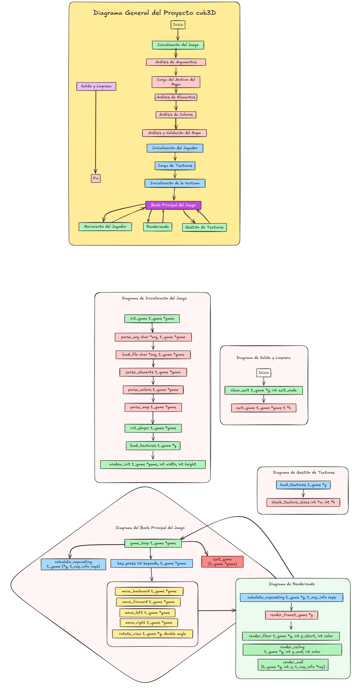

#  Cub3D  

## Introducción  
Cub3D es la evolución de nuestro `so_long`, y utilizaremos estas mismas funciones:  
- Relleno de mapas.  
- Gestión de pulsaciones de teclas.  
- Renderización de imágenes en pantalla.  

## Entendiendo el Ray Casting  
El **ray casting** es la base de Cub3D, permitiendo crear entornos 3D mediante técnicas 2D. Simula la proyección de rayos desde la perspectiva del jugador para generar profundidad y perspectiva.  

### Conceptos clave:  
1. **Proyección de rayos**: Transforma rayos en paredes visibles.  
2. **Texturizado**: Aplica detalles a las superficies mediante matemáticas avanzadas.  


---

## Detalles de Implementación  
Además del ray casting, se requieren:  
- Gestión de *buffers* de imagen.  
- Coloreado de texturas.  

---

## Configuración del Entorno  
**Herramientas necesarias**:  
- Biblioteca **MinilibX** para renderizado gráfico.  

**Recomendación**:  
Usa [42-CLI](https://github.com/herbievine/42-cli) para simplificar la instalación de MLX (compatible con macOS y Linux).  

---

## Las Matemáticas del Ray Casting  
### Paso 1: Dirección del Rayo


Esto implica determinar el ángulo del rayo con respecto a la vista del jugador y convertirlo en un vector unitario.
(Calculo el vector unitario del rayo basado en la posición y orientación del jugador)  
```c
int x = 0;
while (x < WIN_WIDTH) {
    double camera_x = 2 * x / (double)WIN_WIDTH - 1;
    double ray_dir_x = dir_x + plane_x * camera_x;
    double ray_dir_y = dir_y + plane_y * camera_x;
    // ...
}
```
Aquí calculamos la dirección del rayo en función de la dirección del jugador ( dir_xy dir_y), su plano ( plane_xy plane_y) y el plano de la cámara. La camera_xvariable representa la coordenada x del rayo en el espacio de la cámara, que se utiliza para calcular el vector de dirección del rayo.

### Paso 2: Distancia Delta  
Calcula la distancia (delta) entre intersecciones consecutivas en la cuadrícula.
Esto se logra determinando la distancia que debe recorrer el rayo para alcanzar la siguiente línea de cuadrícula en la dirección x o y.


```c
double delta_dist_x = fabs(1 / ray_dir_x);
double delta_dist_y = fabs(1 / ray_dir_y);
```
Esto nos da la distancia que debe recorrer el rayo para llegar a la siguiente línea de la cuadrícula en cada dirección. Tenga en cuenta que tanto "" pos_xcomo pos_y"" se refieren a la posición del jugador.


### Paso 3: Paso Inicial y Distancias Laterales  
Ahora necesitamos calcular las distancias laterales iniciales del rayo en las direcciones x y y. Las variables step_x y step_y determinan la dirección en la que el rayo se mueve a través de la cuadrícula. Las variables side_dist_x y side_dist_y representan inicialmente la distancia que el rayo debe recorrer desde su posición actual hasta la siguiente línea de la cuadrícula en la dirección x o y. Posteriormente, estas variables se actualizarán con la distancia delta a medida que el rayo se desplaza por la cuadrícula. 
```c
if (ray_dir_x < 0) {
    step_x = -1;
    side_dist_x = (pos_x - map_x) * delta_dist_x;
} else {
    step_x = 1;
    side_dist_x = (map_x + 1.0 - pos_x) * delta_dist_x;
}
// ...
```

### Paso 4: Análisis Diferencial Digital (DDA)  
El siguiente paso del algoritmo de raycasting es realizar un Análisis Diferencial Digital (ADD) para determinar la distancia a la siguiente línea de la cuadrícula en la dirección x o y. Esto implica recorrer la cuadrícula y calcular la distancia a la siguiente línea en cada dirección. También anotamos el lado de la pared con el que chocamos (0 para x, 1 para y). Una vez que chocamos con un muro (aquí definido como '1', pero se puede definir de otra manera), salimos del bucle.  
```c
while (42) {
    if (side_dist_x < side_dist_y) {
        side_dist_x += delta_dist_x;
        map_x += step_x;
        side = 0;
    } else {
        side_dist_y += delta_dist_y;
        map_y += step_y;
        side = 1;
    }
    if (map[map_x][map_y] == '1') break;
}
```

### Paso 5: Altura de la Pared  
Calcula la altura de la pared basada en la distancia al muro. Utilizamos la variable wall_dist para determinar la distancia desde la posición actual del rayo hasta el muro. Luego, calculamos la altura de la línea (line_height) en la pantalla basada en esta distancia.
```c
double wall_dist = (side == 0) 
    ? (map_x - pos_x + (1 - step_x) / 2) / ray_dir_x 
    : (map_y - pos_y + (1 - step_y) / 2) / ray_dir_y;

int line_height = (int)(WIN_HEIGHT / wall_dist);
```

---

## Manejo de Texturas 
En el proyecto so_long, simplemente renderizamos nuestras imágenes usando la función integrada de MLX. Sin embargo, como ahora estamos en un mundo 3D, necesitamos calcular nosotros mismos qué píxeles se renderizan. Para ello, podemos descartar nuestras texturas tras la inicialización, almacenándolas en un búfer. El búfer será un array de enteros, donde cada entero representa el color de un píxel.

Descubrí que la mejor manera de hacer esto es tener el siguiente tipo de datos:
### Estructura de Datos  
Este es un pequeño fragmento de cómo puedes actualizar el mapa de píxeles, pero más importante aún, cómo puedes derivar el color de un píxel a partir de una textura.
```c
#define NUM_TEXTURES 4
typedef struct s_data {
    int *texture_buffer[NUM_TEXTURES]; // Buffer para texturas 64x64
} t_data;
```
Imagina que tienes una textura de 64x64 píxeles. El tamaño de texture_buffer[n] será sizeof(int) * 64 * 64. Para obtener un píxel, puedes usar la siguiente fórmula: texture_buffer[n][y * 64 + x]. Esto omite y filas multiplicando el ancho de la textura y luego suma x para obtener el píxel.

Para obtener el valor de un píxel de un puntero de imagen MLX, necesitas usar la función mlx_get_data_addr. Puedes acceder a un píxel de esta manera: img->addr[y * img->width + x]. Recomiendo leer la documentación de esta función para comprender cómo y por qué funciona.

### Acceso a Píxeles 

Usamos un mapa de píxeles que representa los píxeles que se ven en la ventana en una escala 1:1. Así, justo después de proyectar un rayo y determinar la altura de la pared, calculamos cada píxel para ese rayo. Tras realizar la proyección de rayos, podemos dibujar todos los valores distintos de cero en el mapa. Todos los valores cero se dibujan según el color del techo o del suelo.

Nota: Esta no es nuestra solución. A continuación, se incluye el enlace a la explicación y los cálculos.


```

#define TEXTURE_SIZE 64

typedef enum e_cardinal_direction
{
    NORTH = 0,
    SOUTH = 1,
    WEST = 2,
    EAST = 3
} t_cardinal_direction;

t_cardinal_direction dir;
int tex_x;
int color;
double pos;
double step;

dir = ft_get_cardinal_direction();
tex_x = (int)(wall_x * TEXTURE_SIZE);

if ((side == 0 && ray_dir_x < 0) || (side == 1 && ray_dir_y > 0))
    tex_x = TEXTURE_SIZE - tex_x - 1;

step = 1.0 * TEXTURE_SIZE / line_height;
pos = (draw_start - WIN_HEIGHT / 2 + line_height / 2) * step;

while (draw_start < draw_end)
{
    // Aquí puedes calcular el color del píxel a partir de la textura
    int tex_y = (int)pos & (TEXTURE_SIZE - 1);
    pos += step;
    color = texture_buffer[dir][tex_y * TEXTURE_SIZE + tex_x];
    // Dibujar el píxel en el mapa de píxeles
    pixel_map[draw_start * WIN_WIDTH + x] = color;
    draw_start++;
}

```


```c
color = texture_buffer[dir][y * 64 + x];
```

### Renderizado Eficiente  
Usa `mlx_get_data_addr` para manipular imágenes directamente:  
```c
t_img image;
image.img = mlx_new_image(mlx_ptr, WIN_WIDTH, WIN_HEIGHT);
image.addr = (int *)mlx_get_data_addr(image.img, &image.bpp, &image.line_length, &image.endian);
image.addr[y * (image.line_length / 4) + x] = 0x00FF00; // Asigna color verde
```

---

## Optimización de Rendimiento  
- **Evita renderizar píxeles individualmente**: Usa buffers de imagen.  
- **Movimiento fluido**: Implementa velocidades adaptativas para diferentes hardware.  

---

## Errores Comunes  
1. **Matemáticas mal entendidas**: Depuración difícil.  
2. **Movimiento no continuo**: Asegura que las teclas mantengan la acción.  
3. **Velocidades fijas**: Ajusta según el sistema para evitar inconsistencia.  

---

## Conclusión  
Cub3D es un proyecto desafiante pero gratificante. ¡Disfruta el proceso de creación de tu motor 3D!  

### Recursos Adicionales  
- [Artículo sobre so_long](https://ejemplo.com/so_long)  
- [Introducción al Raycasting por Lode Vandevenne](https://lodev.org/cgtutor/raycasting.html)
- [Tutorial de Raycasting en 2D por 3DSage](https://youtube.com/3DSage)  
- [42-CLI por Herbie Vine](https://github.com/herbievine/42-cli)  


# Diagramas del Proyecto:


